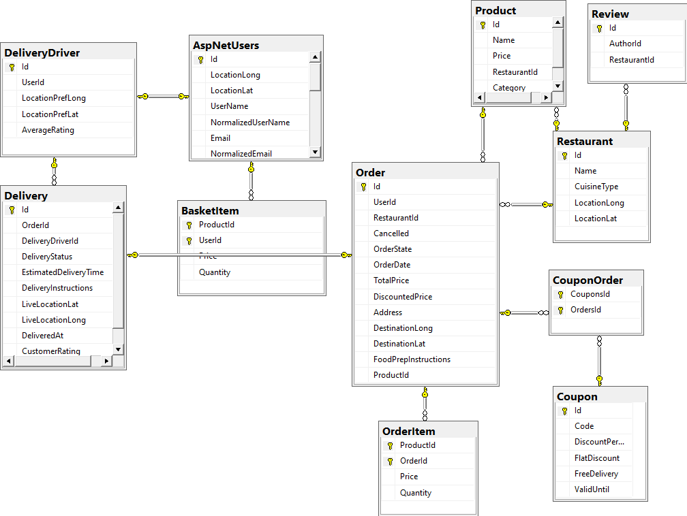
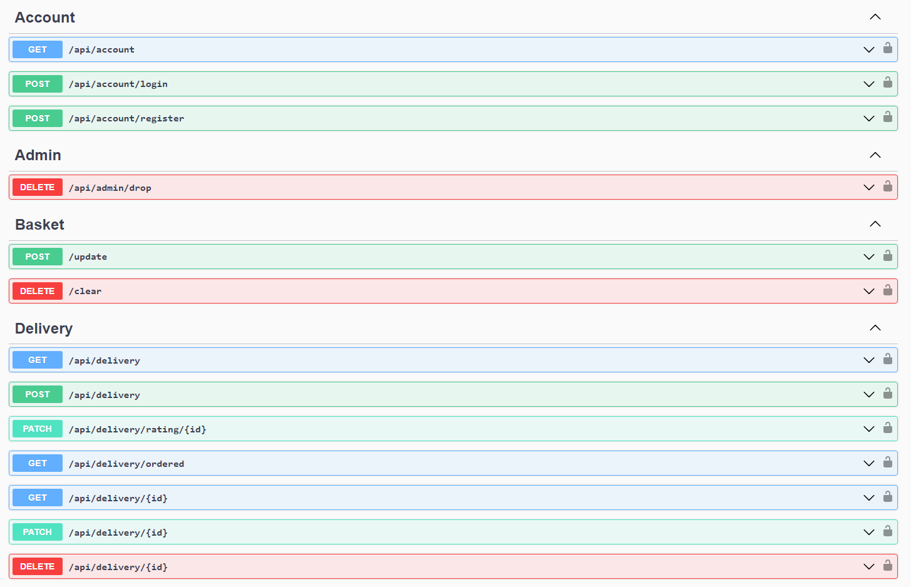
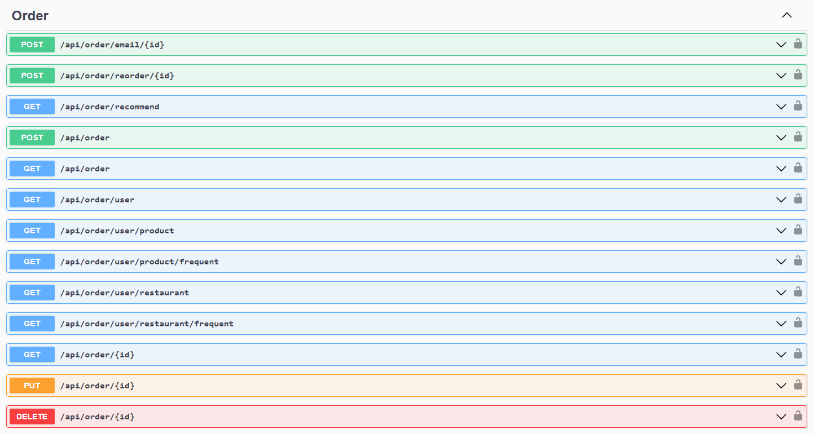
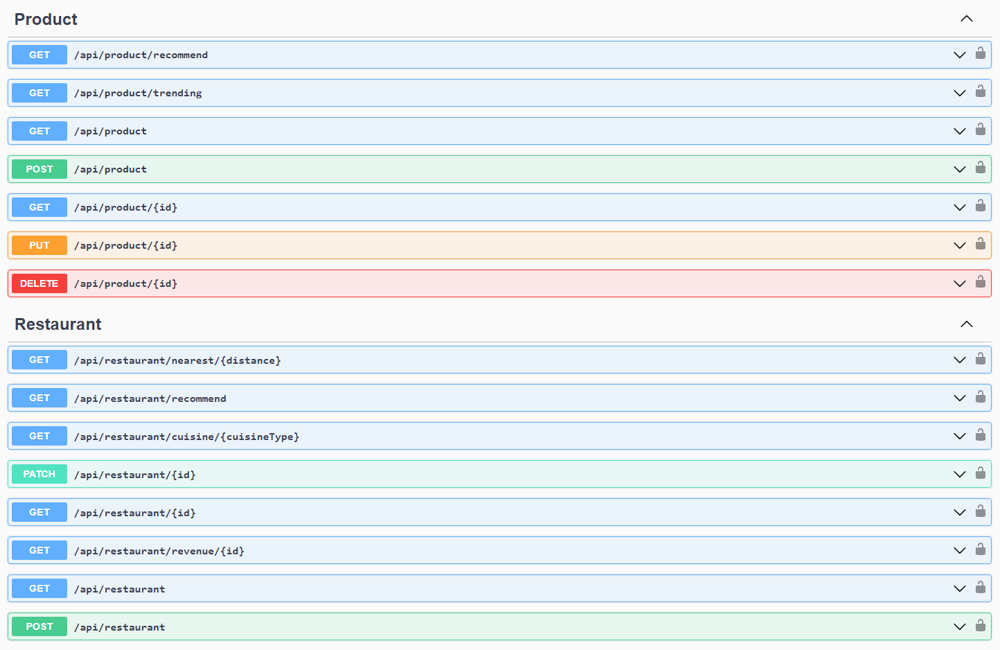

<p align="center"> 
  
</p>
<h1 align="center">Online Fast Food App</h1>
<h3 align="center">An ASP.NET Core application mimicing the features of Just Eat, the online restaurant and delivery platform.</h3>  


## Getting Started

### Prerequisites
Requirements to build and run the project locally.
- Docker

Or if you don't want to use docker:

- .NET 8
- SQL Server 2022
- Node.js


### Usage

- Start the frontend and API server:
```bash
docker compose up
```

- Stop the app:
```bash
docker compose down
```

Visit http://localhost:3000 for the frontend.

Visit http://localhost:8080/swagger for the REST API documentation, and a UI for running some authenticated requests. The API runs at http://localhost:8080/api.


### Features
Split into user facing and software implementation features (frameworks used, design etc.)

#### User Functionality
- Delivery system
    - Uses a dedicated delivery driver role
    - Driver rating by users
    - Tracking and arrival time estimation using location
    - Nearest driver to the restaurant selected at order time

- User recommendations
    - Recommends products and restaurants based on categorical similarity with order history
    - Also uses frequently ordered at restaurants / bought products
    - Globally trending products / local restaurants since last week

- Online basket
    - List of items before ordering
    - Coupons applied at checkout

- Locations
    - Users, Delivery drivers and restaurants have locations
    - For finding nearby restaurants, estimating delivery time, and selecting a nearby driver

- Partner role
    - The restaurant owner role
    - Get restaurant revenue
    - Manages menu products


#### Software Implementation
- Entity framework core
    - Abstracts database relationships, removing the need for a foreign key in code
    - Use indexing to ensure efficient querying based on use case
- ASP.NET Identity 
    - JWT authentication, a lightweight solution. Stores user ID in payload.
    - Resource-base authorization (using policies) to restrict access to data using business logic.
    - Role-based authorization (User, Partner, DeliveryDriver, Admin).
- Useful Patterns
    - Repository for data access
    - Service for business logic without data access
    - Unit of work for multiple database updates
- ASP.NET Web API
    - API endpoint routing, and status code handling

### SQL Database Diagram

<p align="center"> 
  
</p>

### API Overview

<p align="center"> 
  
</p>

<p align="center"> 
  
</p>

<p align="center"> 
  
</p>

### Extra features
Other interesting features I could add in the future:
- Group ordering for multiple users to place one order together, and pay once.
- Automatically adjusting menu pricing based on recent demand, to maximize revenue.
- Contextual recommendations based on the time of day, user's location, active discouns/promotions.